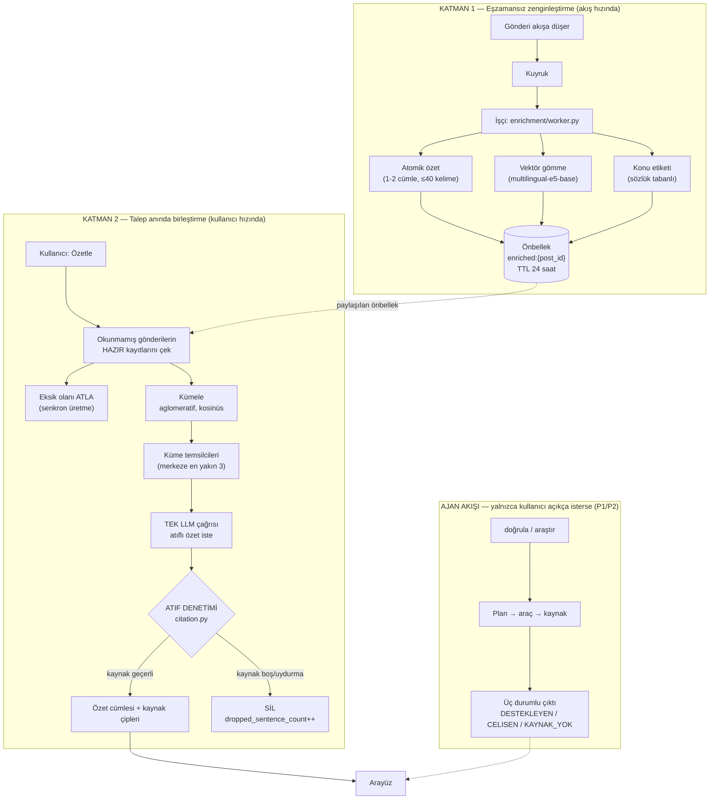
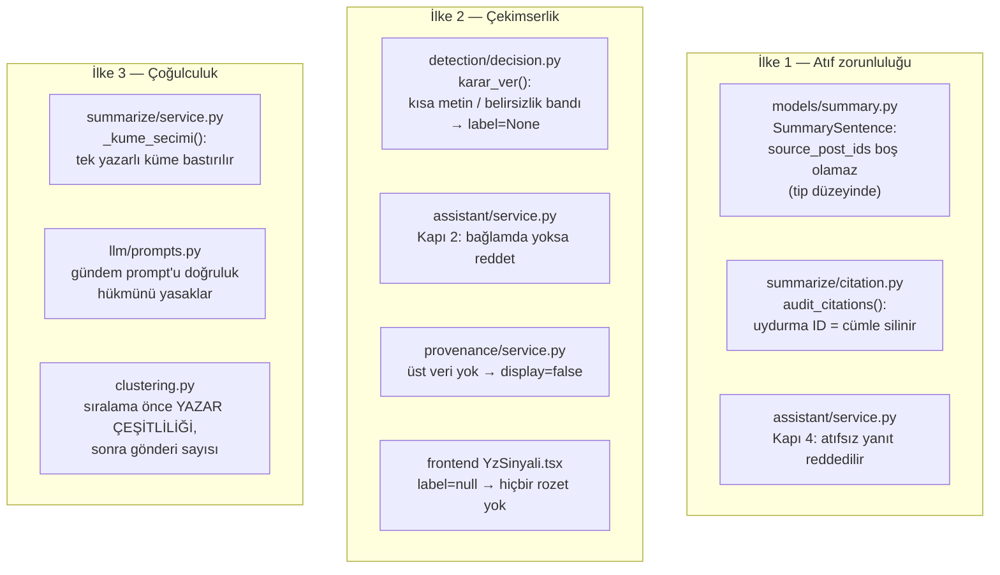
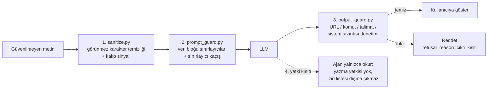
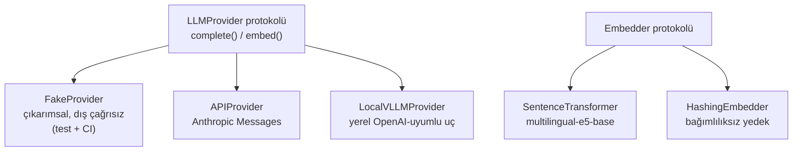
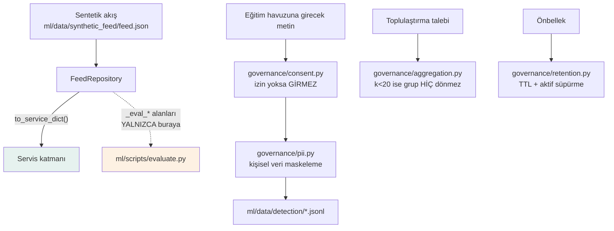

# MİHENK — Mimari

> Bu belge raporun 3.1 bölümüne **Şekil 1** olarak girer.
> Şemalar Mermaid ile yazılmıştır; GitHub üzerinde doğrudan render edilir.

## 1. Problem ve mimari karar

Kullanıcı "Özetle" düğmesine bastığında 200 okunmamış gönderiyi tek bir prompt'a
doldurmak iki sorun üretir:

1. **Gecikme.** Uzun bağlam, p95 yanıt süresini 20 saniyenin üzerine çıkarır.
   Kullanıcı akışta beklemez.
2. **Maliyet.** Her kullanıcı kendi akışının tamamını yeniden işletir; maliyet
   kullanıcı sayısıyla **doğrusal** büyür.

MİHENK bu yüzden işi ikiye böler. Ayrım pazarlama değil, maliyet ve gecikme
kararıdır.



### Neden bu ayrım maliyeti düşürür

Atomik özet **kullanıcıdan bağımsızdır**: aynı gönderiyi 1000 kişi görse de bir
kez üretilir ve önbellekte paylaşılır. Kullanıcı başına tekrarlanan tek pahalı
işlem, özet başına **tek** birleştirme çağrısıdır.

Ölçülen değerler (`eval/results/summarization.md`):

| Ölçüm | Değer |
|---|---|
| Akıştaki gönderi | 420 |
| Yapılan atomik özet çağrısı | 227 |
| Kısa olduğu için çağrı yapılmayan gönderi | 193 |
| Zenginleştirmede çağrı tasarrufu | ~%46 |
| Özet başına birleştirme çağrısı | 1 |

15 kelimeden kısa gönderilerde özet üretilmez (metnin kendisi zaten özettir);
bu tek kural, çağrı sayısını gönderi sayısının yarısına indirir.

## 2. Katmanlar ve sorumlulukları

```mermaid
flowchart LR
    subgraph UI["Arayüz — frontend/"]
        U1["Akış kartı"]
        U2["Özet paneli"]
        U3["Asistan çekmecesi"]
        U4["İtiraz akışı"]
    end

    subgraph API["API — backend/app/main.py"]
        direction TB
        E1["/api/akis"]
        E2["/api/ozetle<br/>+ /api/ozetle/metinler"]
        E3["/api/sor"]
        E4["/api/tespit<br/>(kimlikli + kimliksiz)"]
        E5["/api/koken"]
        E6["/api/itiraz"]
    end

    subgraph SRV["Servis katmanı — ilkeler BURADA uygulanır"]
        S1["enrichment/<br/>KATMAN 1"]
        S2["summarize/<br/>KATMAN 2 + atıf denetimi"]
        S3["assistant/<br/>bağlam sınırı + 5 kapı"]
        S4["detection/<br/>model + çekimserlik"]
        S5["provenance/<br/>üç katmanlı köken"]
        S6["security/<br/>enjeksiyon savunması"]
        S7["governance/<br/>PII, izin, k-eşiği, TTL"]
    end

    subgraph ALT["Altyapı"]
        L1["llm/provider.py<br/>soyutlama"]
        L2["llm/embedding.py"]
        L3["store/cache.py<br/>TTL önbellek"]
        L4["store/feed_repo.py"]
    end

    UI --> API --> SRV --> ALT
```



**Kritik kural:** İlkeler API katmanında değil, servis katmanında uygulanır.
Arayüze zaten temiz veri gider. Bunun sebebi ölçümdür: `ml/scripts/evaluate.py`
servis fonksiyonlarını doğrudan çağırır; mantık uç noktalara sızsaydı ölçtüğümüz
kod ile kullanıcının çalıştırdığı kod farklı olurdu.

## 3. Üç ilkenin kod karşılığı



Her ilkenin en az bir koruyucu testi vardır:
`backend/tests/test_ilke1_atif.py`, `test_ilke2_cekimserlik.py`,
`test_ilke3_cogulculuk.py`.

## 4. İstem enjeksiyonu savunma zinciri

Gönderi metni ve web içeriği **güvenilmeyen girdidir**. Saldırgan gönderiyi
yazan üçüncü kişidir; kurban onu özetleten okuyucudur.



Ölçüm: `eval/injection_suite.yaml` (40 senaryo, 9 saldırı türü) →
`eval/results/injection.md`.

## 5. Sağlayıcı soyutlaması



Kod hiçbir yerde belirli bir sağlayıcıya doğrudan bağlanmaz; geçiş tek dosyada
olur. Bu, raporun 6.2 (Teknik Sürdürülebilirlik) bölümünde iddia edilen dış
bağımlılıktan çıkabilme yeteneğinin kod karşılığıdır.

## 6. Veri akışı ve yönetişim sınırı



`_eval_*` alanları (YZ etiketi, enjeksiyon etiketi, olay kimliği) **hiçbir zaman**
servis katmanına veya prompt'a girmez. Bu, `backend/tests/test_eval_sizinti.py`
ile test edilerek garanti altına alınmıştır — iyi niyete bırakılmamıştır.

## 7. Dizin haritası

```
mihenk/
├── backend/app/
│   ├── main.py           FastAPI uç noktaları (ince katman)
│   ├── config.py         TÜM eşik değerleri (kodda gömülü sayı yok)
│   ├── models/           Pydantic şemaları — ilkeler tip düzeyinde
│   ├── llm/              Sağlayıcı soyutlaması + prompt'lar
│   ├── enrichment/       KATMAN 1
│   ├── summarize/        KATMAN 2 + kümeleme + atıf denetimi
│   ├── assistant/        Bağlam sınırlı soru-cevap (5 kapı)
│   ├── detection/        YZ sinyali + çekimserlik kuralları
│   ├── provenance/       C2PA / IPTC köken denetimi
│   ├── security/         İstem enjeksiyonu savunması
│   ├── governance/       PII, izin, k-eşiği, saklama sınırı
│   └── store/            TTL önbellek + akış deposu
├── ml/
│   ├── data/             Sentetik akış + tespit veri seti
│   ├── scripts/          Üretim, eğitim, ÖLÇÜM betikleri
│   └── artifacts/        Model ağırlıkları (git'e girmez)
├── frontend/src/         React + Vite + TypeScript + Tailwind
└── eval/                 Kırmızı takım kümesi + ölçüm çıktıları
```
