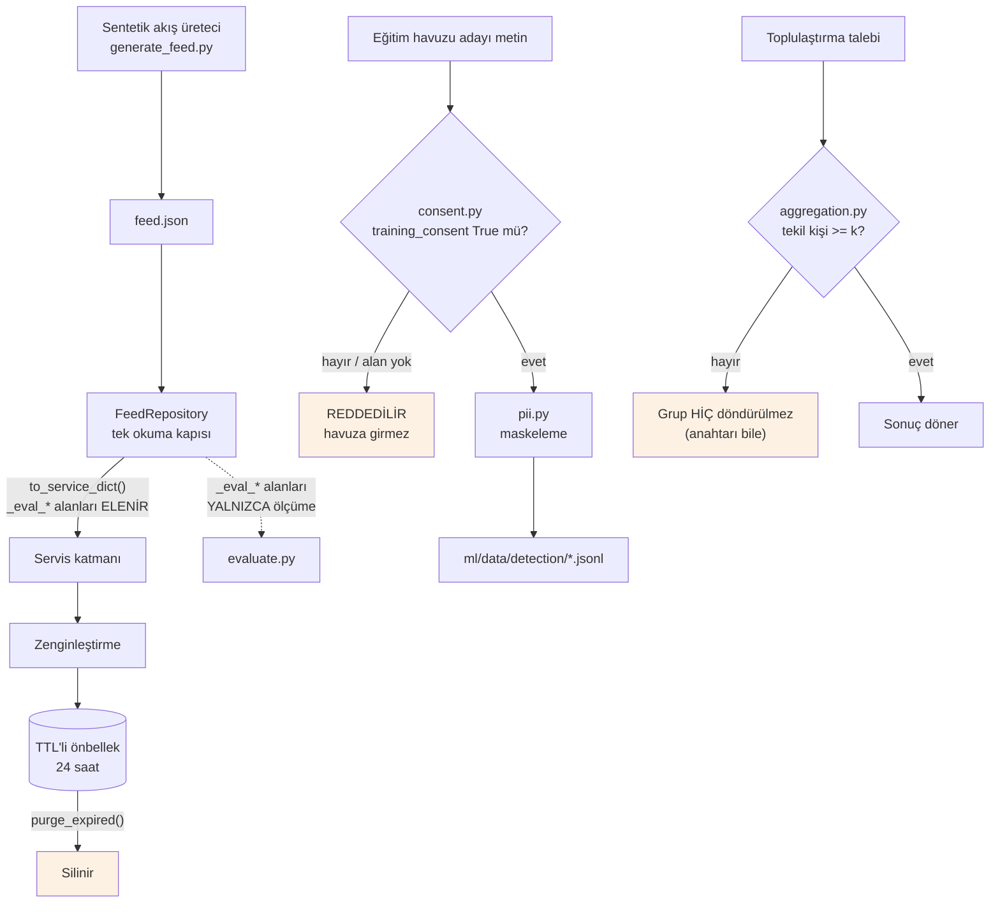

# Veri Yönetişimi

> Raporun 6.2 bölümünün kaynağıdır. Buradaki her iddianın karşılığı
> `backend/app/governance/` altında **çalışan kod** ve
> `backend/tests/test_governance.py` altında **geçen test**tir.
> Jüri kodu isteyebilir; belge tek başına savunma değildir.

## 1. Veri envanteri — prototipte ne var, ne yok

| Veri türü | Prototipte durumu | Gerekçe |
|---|---|---|
| Gerçek sosyal medya gönderisi | **YOK** | Kazıma yasak (spec 2). Gerçek gönderi gerçek kişinin verisidir. |
| Gerçek kullanıcı adı / profil | **YOK** | Tüm yazarlar sentetik takma addır (`@gecevardiyasi34` gibi). |
| Gerçek kişi adı (metin içinde) | **YOK** | Kurgusal şehir, takım, kurum ve sporcu adları kullanıldı. |
| Konum, cihaz, IP | **YOK** | Toplanmıyor. |
| Okuma durumu | Geçici | İstemci tarafında; sunucuda kalıcı tutulmuyor. |
| İtiraz kaydı | Geçici (TTL) | Gerçek sistemde insan inceleme kuyruğuna gider. |
| Zenginleştirme çıktısı | Geçici (TTL 24 saat) | Özet için çekilen içerik kalıcı saklanmaz. |

**Sonuç:** Prototipte KVKK kapsamına giren kişisel veri işlenmemektedir. Buna
rağmen tüm yönetişim kapıları kodda kuruludur ve testlidir — çünkü bir veri
yönetişim iddiası sistem büyüdükten sonra eklenemez.

## 2. Veri akış şeması

## 3. Dört kapı ve kod karşılıkları

### 3.1 İzin kapısı — `governance/consent.py`

**Kural:** `training_consent` alanı bulunmayan veya `True` olmayan hiçbir kayıt
eğitim havuzuna giremez.

**Varsayılan reddetmedir.** Alan eksikse izin var sayılmaz. Yalnızca boolean
`True` kabul edilir; `"true"` dizgesi, `1`, `"evet"` reddedilir — çünkü tip
gevşekliği izin gibi kritik bir alanda sessiz hataya yol açar (Python'da
`"false"` dizgesi doğru sayılır).

**Neden şimdiden var:** İzin kontrolü sonradan eklendiğinde, o ana kadar
toplanmış tüm veri "izinsiz toplanmış" olur ve bu geriye dönük düzeltilemez.

Test: `test_izinsiz_kayit_egitim_havuzuna_giremez`, `test_assert_consent_hata_firlatir`.

### 3.2 Kişisel veri maskeleme — `governance/pii.py`

Eğitim havuzuna giren her metin buradan geçer. Maskelenen kalıplar:

| Tür | Örnek | Sonuç |
|---|---|---|
| E-posta | `ornek@test.com` | `[EPOSTA]` |
| Telefon | `0532 111 22 33` | `[TELEFON]` |
| TC Kimlik No | 11 haneli sayı | `[TCKN]` |
| IBAN | `TR33 0006 ...` | `[IBAN]` |
| URL | `https://...` | `[URL]` |
| Kullanıcı adı | `@kullanici` | `[KULLANICI]` |

Silme yerine yer tutucu kullanılır: cümle yapısı korunur, içerik kaybolur.

**Kapsam sınırı (dürüstlük notu):** Kalıp tabanlı maskeleme, serbest metindeki
ad-soyad gibi verileri yakalayamaz. Prototipte sorun değildir (veri sentetik ve
gerçek kişi içermiyor); gerçek veriye geçişte adlandırılmış varlık tanıma (NER)
katmanı eklenmelidir. Bu, bilinen ve kayıtlı bir eksikliktir.

Test: `test_pii_maskelenir` (5 kalıp), `test_temiz_metin_degismez`.

### 3.3 k-eşikli toplulaştırma — `governance/aggregation.py`

**Kural:** `k` (varsayılan 20) eşiğinin altındaki gruplar **hiç döndürülmez.**
Maskelenmez, "az" diye işaretlenmez, yuvarlanmaz — sonuçtan tamamen çıkarılır.
Bastırılan grupların **anahtarları da** döndürülmez; "Yaltepe grubu bastırıldı"
bilgisi tek başına "orada az kişi var" demektir.

**Neden bu kadar sert:** Sayıyı yuvarlamak veya `<5` göstermek de sızıntıdır;
farklı sorguların kesişimi gerçek sayıyı geri verir (diferansiyel saldırı).

**Kişi sayısı esas alınır, kayıt sayısı değil:** Tek kişinin 40 gönderisi hâlâ
tek kişidir. k-anonimlik kişi sayısıyla ilgilidir.

Test: `test_toplulastirma_k_esigi_altinda_dondurmez`,
`test_toplulastirmada_kisi_sayisi_esas_alinir`.

### 3.4 Saklama sınırı — `governance/retention.py`

| Veri | TTL | Gerekçe |
|---|---|---|
| Zenginleştirme çıktısı | 24 saat | Akış hızını korumak için tutulur, arşiv değildir |
| Okuma durumu | 6 saat | Kullanıcı davranışı en hassas veridir, en kısa yaşar |
| Özet çıktısı | 5 dakika | Yalnızca kısa süreli tekrar isteklerini karşılar |

`purge_expired()` yalnızca okunan kayıtları değil, **hiç okunmayan** süresi
dolmuş kayıtları da siler — "TTL koyduk" demenin ötesine geçer.

`forget_user(user_id)` unutulma hakkının (KVKK md. 7 / GDPR md. 17) kod
karşılığıdır.

Test: `test_suresi_dolan_kayit_okunamaz_ve_temizlenir`,
`test_purge_expired_okunmayan_kayitlari_da_siler`, `test_kullanici_durumu_silinebilir`.

## 4. Değerlendirme etiketlerinin ayrımı

Sentetik akıştaki `_eval_is_ai_generated`, `_eval_has_injection`,
`_eval_is_manipulative`, `_eval_event_id` alanları **doğru cevaptır**.

Servis katmanına veya prompt'a sızarlarsa tüm ölçüm geçersiz olur: model tespit
etmiş gibi görünür ama aslında cevabı okumuştur.

Ayrım tek bir kapıdan yapılır (`Post.to_service_dict()`) ve testle korunur:
`backend/tests/test_eval_sizinti.py` — üç prompt üreticisinin çıktısında,
zenginleştirme kaydında ve API yanıtında bu alanların bulunmadığını doğrular.
Ayrıca ters kontrol vardır: alanların veri dosyasında gerçekten bulunduğunu da
test eder (aksi halde "sızıntı yok" sonucu, alanların hiç üretilmemiş olmasından
da doğabilirdi).

## 5. Gerçek veriye geçiş için gereken adımlar

Prototip gerçek veriyle çalışmaya hazır değildir. Aşağıdakiler tamamlanmadan
gerçek kullanıcı verisi işlenmemelidir:

1. **NER tabanlı PII katmanı** — kalıp eşleştirmeye ek olarak ad-soyad, adres,
   kurum tespiti.
2. **Aydınlatma metni ve açık rıza akışı** — `training_consent` alanının
   gerçek bir kullanıcı onayından gelmesi.
3. **Veri işleme envanteri ve VERBİS kaydı** — yasal yükümlülük.
4. **Saklama sürelerinin hukuk onayı** — TTL değerleri şu an mühendislik
   kararıdır, hukuki gerekliliklerle doğrulanmalıdır.
5. **Erişim kaydı (audit log)** — kimin hangi veriye eriştiğinin izlenmesi.
6. **Sınır ötesi aktarım değerlendirmesi** — LLM sağlayıcısı yurt dışındaysa
   KVKK md. 9 kapsamında değerlendirme; sağlayıcı soyutlaması (bkz.
   `docs/MIMARI.md` bölüm 5) bu riski yerel modele geçerek kapatma imkânı verir.
